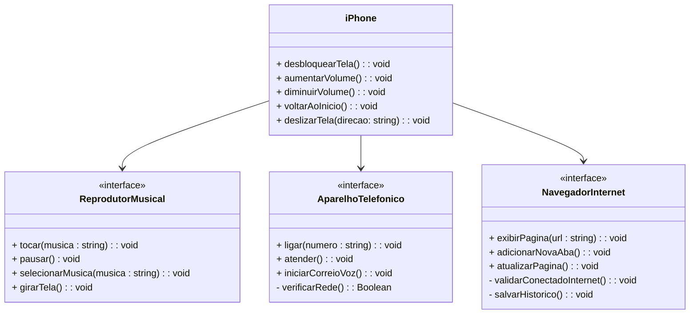

## Desafio - Programação Orientada a Objetos

Este repositório representa um desafio de modelagem e diagramação UML do componente iPhone, abrangendo suas funcionalidades como Reprodutor Musical, Aparelho Telefônico e Navegador na Internet. Este projeto faz parte do Bootcamp Santander 2024 - Backend com Java.

## Modelo do Diagrama

